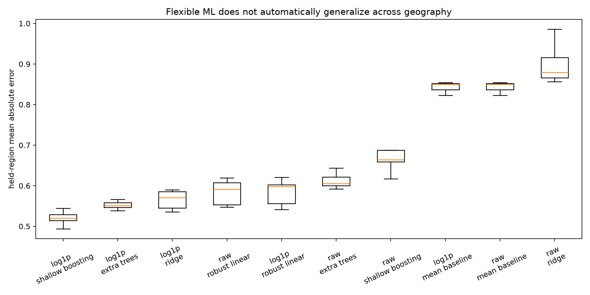
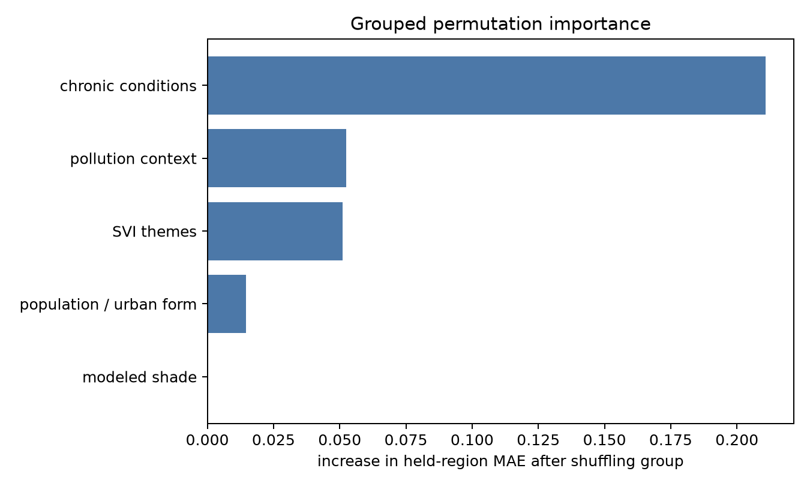

# Spatial ML spike: what machine learning adds

**Status:** throwaway research spike; not a production recommendation
**Question:** Can modest, interpretable machine learning improve geographic
prioritization without creating a misleading “AI risk score”?

## Bottom line

Machine learning is scientifically useful here, but product-negative.

A shallow gradient-boosting model can rank held-out Los Angeles County ZCTAs
reasonably well (`Spearman = 0.784`) and recover 75% of the actual top third.
It also reduces mean absolute error by about 39% relative to predicting the
county mean. However, it predicts the *magnitude* of the most extreme outcome
poorly (`R² = 0.063`). Random cross-validation materially overstates performance.

The StoryMap and dashboard should therefore retain transparent terciles and
bivariate categories. ML belongs in the methods audit, not in the public-facing
priority definition.

## Lab design

The target was `historical_heat_er` for 294 ZCTAs. Nineteen candidate predictors
were organized into five understandable groups:

- four Social Vulnerability Index themes;
- six chronic-condition prevalence estimates;
- two modeled shade variables;
- five pollution-context variables;
- population and population density.

Target-derived fields—including the historical tercile, priority category,
response index, and draft score—were excluded to prevent leakage.

Five model families were tested on both the raw and `log1p` outcome:

1. county-mean baseline;
2. ridge regression;
3. Huber robust regression;
4. shallow histogram gradient boosting;
5. extremely randomized trees.

The lab used eight rotated, equal-count geographic partitions, each with five
held-region folds. Every ZCTA received one out-of-fold prediction in each
partition. This is deliberately harder and more realistic than randomly mixing
nearby places between training and validation sets. Repeated random five-fold
validation was retained only as a diagnostic comparison.

In total, the final run fit roughly 1,240 models across the main comparison,
outlier sensitivity, and feature-source ablation. It completed in 244 seconds
with about 353 MB maximum resident memory on an Apple M5 Pro.

## Main result

Median countywide out-of-fold performance across the eight spatial partitions:

| Model | Target | MAE | R² | Spearman rank | Top-third recall |
|---|---:|---:|---:|---:|---:|
| Shallow boosting | `log1p` | **0.520** | 0.063 | **0.784** | **0.750** |
| Extra Trees | `log1p` | 0.551 | 0.047 | 0.757 | 0.709 |
| Ridge | `log1p` | 0.571 | **0.081** | 0.737 | 0.689 |
| Huber regression | `log1p` | 0.598 | **0.081** | 0.709 | 0.653 |
| Mean baseline | raw | 0.850 | -0.019 | — | — |

Ridge and Huber slightly outperform boosting on R², while boosting clearly wins
on absolute error, rank ordering, and top-third recovery. For a prioritization
product, those latter criteria are more relevant—but they still do not make the
model suitable as a public score.



## What random validation would have told us

For the winning model, random validation reported `MAE = 0.453`,
`Spearman = 0.858`, and top-third recall of `0.832`. Held-region validation
reported `MAE = 0.520`, `Spearman = 0.784`, and recall of `0.750`.

Thus spatial generalization increased error by about 15% and reduced apparent
ranking performance. Nearby places share environmental, demographic, and
data-production processes; ordinary random folds allow some of that information
to leak across the validation boundary.

## What features helped

Grouped held-region permutation importance measured how much prediction error
increased when a whole feature family was shuffled:

| Feature family | Median added MAE |
|---|---:|
| Chronic conditions | **0.211** |
| Pollution context | 0.052 |
| SVI themes | 0.051 |
| Population / urban form | 0.015 |
| Modeled shade | 0.000 |



This is incremental predictive importance, not a causal effect. Correlated
groups can substitute for each other. Shade's near-zero conditional importance
does not make it irrelevant: shade is an actionable intervention condition,
whereas a predictor can be highly predictive and impossible to change.

The source ablation supports that distinction:

| Feature set | MAE | Spearman | Top-third recall |
|---|---:|---:|---:|
| Expanded, including pollution | **0.520** | **0.784** | **0.750** |
| Final six structural indicators | 0.552 | 0.751 | 0.709 |
| SVI + chronic conditions | 0.562 | 0.739 | 0.704 |
| Chronic conditions only | 0.577 | 0.721 | 0.684 |
| SVI themes only | 0.649 | 0.590 | 0.633 |
| Shade only | 0.758 | 0.265 | 0.398 |

Pollution variables improve MAE by about 6% over the current final-six set.
That is enough to keep them in the research lab, but not automatically enough to
add another public-facing pillar. The gain must be weighed against conceptual
overlap, data provenance, and product simplicity.

## The finding that changes the interpretation

The outcome is extremely skewed. Its median is 1.677, its 99th percentile is
3.803, and its maximum is 47.160. ZCTA 90089 is the maximum. Its interpolated
value is driven primarily by source tract `06037222700`, whose source outcome is
63.44; the next-highest ZCTA is only 9.45.

Removing that single ZCTA as a *sensitivity test*, not as a proposed cleaning
step, changes the winning model to `MAE = 0.380`, `R² = 0.450`, and
`Spearman = 0.769`. The model ranking remains stable, but the ordinary-scale R²
becomes far more meaningful. One source-driven extreme value therefore dominates
the countywide variance while having much less influence on rank performance.

This result strengthens the case for rank/tercile communication. It also creates
a concrete source-audit task: verify the event definition, denominator,
suppression rules, uncertainty, and crosswalk behavior for tract `06037222700`
before interpreting magnitude-based models. The value should not be deleted
merely because it is inconvenient.

## Residual geography

Residual Moran's I was `0.031` with a permutation p-value near `0.015`. The
remaining clustering is small but detectable. This may represent omitted
place-based factors or shared interpolation/data-generation structure. It is a
warning against treating residuals as independent and against using conventional
random-fold uncertainty claims.

## What failed or changed during the spike

Two early choices were rejected:

- Fold-median metrics hid the influence of the extreme outcome and gave unequal
  weight to differently sized geographic folds. The final lab uses pooled
  countywide out-of-fold metrics so every ZCTA contributes once per partition.
- Repeated K-means geographic folds turned out to be identical across seeds.
  They created the appearance of repeated validation without changing the
  boundary. The final design rotates spatial bands through eight orientations.

Raw-outcome models also performed poorly. The `log1p` transformation was
essential: raw shallow boosting produced `MAE = 0.664` and
`Spearman = 0.615`, versus 0.520 and 0.784 on the transformed target.

These failures are part of the result. They show why a plausible ML notebook can
look rigorous while still producing optimistic or unrepresentative evidence.

## Why no GPU experiment was run

The machine exposes a 16-core Apple GPU with Metal 4, but the analytic table has
only 294 rows and 19 predictors. PyTorch, XGBoost, LightGBM, and CatBoost were not
installed; scikit-learn was. Installing a GPU stack or fitting a neural network
would add engineering overhead and overfitting risk without a credible
statistical benefit. The final CPU run was slow only because it repeated more
than a thousand small fits, not because any individual model was compute-bound.

GPU acceleration becomes relevant if the project later learns directly from
large raster tiles, satellite imagery, or millions of pixels. It is not relevant
to this tabular policy dataset.

## Product recommendation

For the ArcGIS StoryMap and dashboard:

- do not publish a black-box prediction or composite ML score;
- keep the transparent historical-harm × structural-risk categories;
- use ML evidence to explain that chronic conditions and SVI generalize beyond
  neighboring areas;
- describe shade as an intervention condition, not as the strongest predictor;
- keep pollution as a candidate research context layer pending source and scope
  review;
- flag 90089/source tract `06037222700` for provenance review;
- communicate rankings or categories rather than precise predicted magnitudes.

Revisit ML only if the project gains multi-year outcome counts, reliable
uncertainty estimates, or enough temporal data to hold out whole years as well
as whole regions. At that point, shallow boosting or an interpretable generalized
additive model would still be preferable to deep learning.

## Reproduction

From the experiment worktree:

```bash
uv run python -m ccphit.analysis.ml_spike
```

Outputs are written to ignored `data/ml_spike/`. The prototype is intentionally
isolated on `experiment/spatial-ml-spike`; it should be deleted or selectively
absorbed after review rather than merged wholesale.
