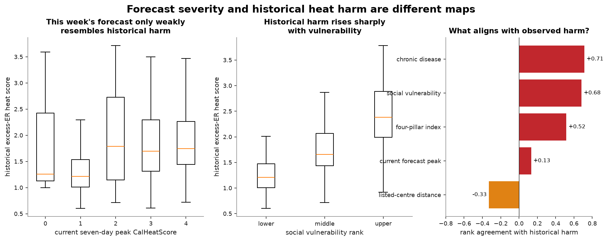
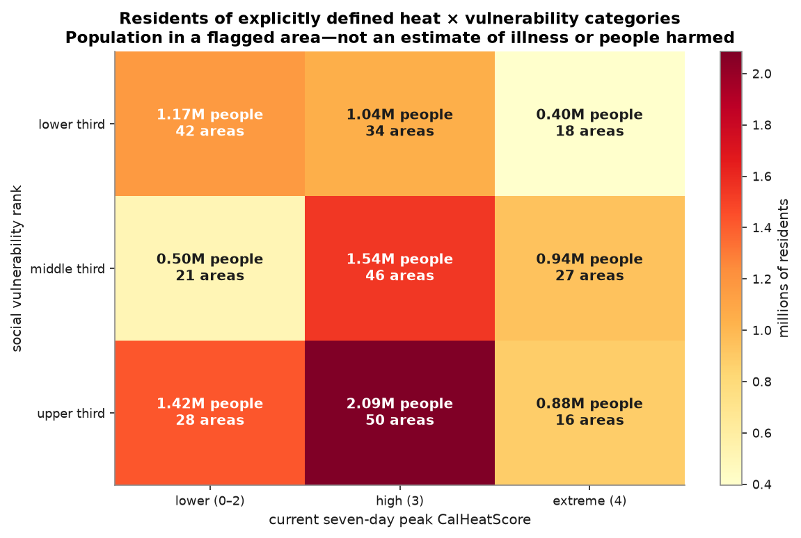
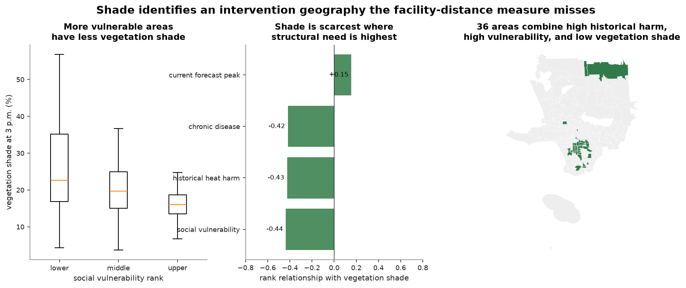
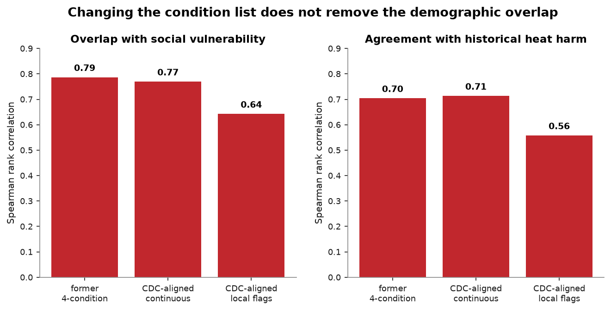
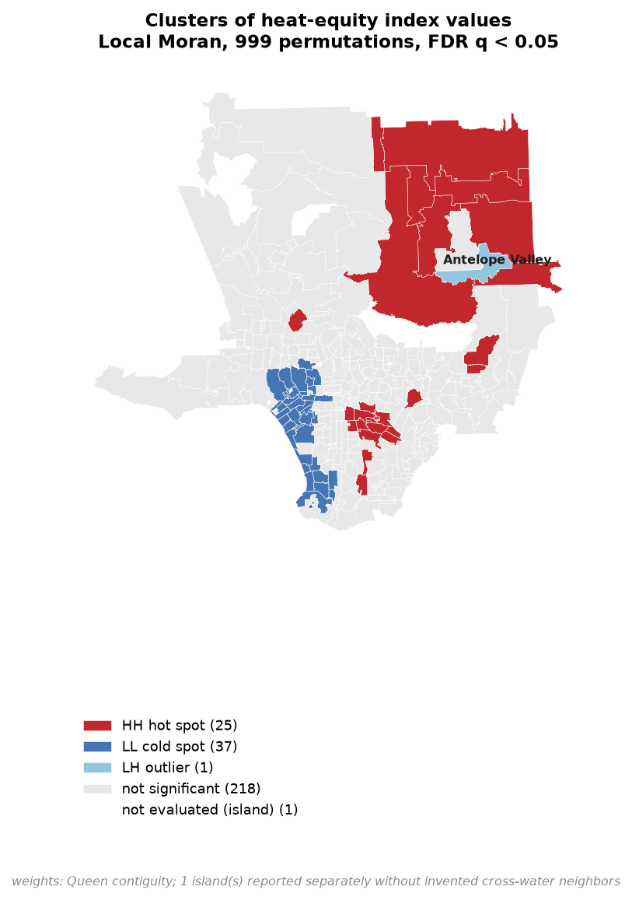

# LA heat equity needs two maps, not one universal score

## Executive finding

Los Angeles County needs different information for an emergency this week and
for investment over the next decade.

- **Emergency response:** Where will the current forecast be most dangerous for
  people who are already more susceptible?
- **Long-term investment:** Where has heat historically caused harm, and which
  protective conditions are missing?

The original four-pillar score mixed these decisions. The experiments show why
they should be separated.

This analysis covers 294 ZIP Code Tabulation Areas (ZIP-code areas), of which
282 have complete values for the current draft index. PLACES and SVI remain the
two assignment-required sources throughout.

## 1. This week's forecast is not the same map as historical harm

LA County's
[Climate-Ready Communities Assessment 2023](https://www.arcgis.com/home/item.html?id=fefe544f3ddb413a82ebb11e2a42f974)
publishes a tract-level heat score based on excess emergency-room visits. After
translating that score to the project's ZIP-code areas, the
current seven-day peak CalHeatScore has only **0.13 rank agreement** with
historical heat harm. In plain language, areas near the top of this week's
forecast are often not the areas near the top of the historical harm map.

Social vulnerability and chronic disease align much more strongly with
historical harm:

| Project measure | Rank agreement with historical harm |
|---|---:|
| Current forecast peak | +0.13 |
| Social vulnerability | +0.68 |
| Chronic disease | +0.71 |
| Four-pillar draft index | +0.52 |
| Distance to a listed cooling center | **−0.33** |



This changes the report's central claim. The data do **not** support a general
statement that heat harm is independent of vulnerability. They support a
narrower and more useful statement:

> Weather determines where danger is imminent. Vulnerability helps determine
> where heat has historically produced emergency-room harm.

### Two priority groups

For current response, **16 ZIP-code areas containing 878,241 residents** are
both in the upper third for social vulnerability and at CalHeatScore 4 in the
current forecast.

For structural investment, **68 areas containing 3,359,117 residents** are both
in the upper third for vulnerability and the upper third for historical heat
harm. Only **10 areas** appear in both groups.

These are residents of areas meeting declared conditions—not estimates of
people who will become ill.

## 2. Population belongs after a category rule, not after an index

The former report multiplied a percentile-based index by population and called
the result “burden.” That operation has been retired. An index score of 80 is
ranked above 40, but it does not mean twice as much illness or twice as many
people at risk.

The replacement simply declares the heat and vulnerability categories and then
counts Census population once:



The largest cell is not the most extreme one: 2.09 million residents live in
upper-third-vulnerability areas with a current CalHeatScore of 3. The
upper-third/extreme cell contains 878,241 residents. Both numbers are
understandable without pretending the index is a case count.

## 3. Cooling centers are useful facilities, but distance is not health access

Cooling centers still belong in the Dashboard as a searchable facility list
with addresses and hours. Straight-line distance from an approximate resident
center does not establish whether a center is open, reachable, acceptable, or
used. A
[2024 systematic review](https://pmc.ncbi.nlm.nih.gov/articles/PMC11516608/)
also found no study that conclusively measured health or wellbeing outcomes
after cooling-center use.

The local validation makes the limitation concrete: areas farther from listed
centers had **lower historical heat harm** (`rho=-0.33`). This likely reflects
the concentration of centers in dense, higher-need communities rather than a
protective effect of distance.

The conclusion is not “cooling centers do not work.” It is:

> This distance measure cannot carry one quarter of a health-risk score or
> justify facility placement by itself.

## 4. Shade produces a more actionable investment geography

A new
[LA County/UCLA shade layer](https://www.arcgis.com/home/item.html?id=53f78d9d6fcf43678a3272de2a15720c)
models building and vegetation shade at 3 p.m. on a summer day in 2023.
Vegetation shade is lower where structural need is higher:

| Relationship with vegetation shade | Rank correlation |
|---|---:|
| Historical heat harm | −0.43 |
| Social vulnerability | −0.44 |
| Chronic disease | −0.42 |
| Current forecast peak | +0.15 |

A simple screen—upper third historical harm, upper third vulnerability, and
lower third vegetation shade—identifies **36 areas and 1,723,130 residents**.
This includes Long Beach 90813, Bell, Florence-Firestone, Huntington Park, and
several Lancaster/Palmdale areas.



Shade does not belong inside the current-response score: it is a potential
intervention condition, and this observational analysis does not estimate a
causal health effect. It does, however, give the long-term investment map a
concrete and policy-relevant next question.

## 5. The chronic-disease revision survived a direct test

The original chronic pillar used asthma, COPD, diabetes, and poor physical
health. The revised version follows the
[CDC Heat & Health Index technical documentation](https://atsdr.cdc.gov/place-health/media/pdfs/2024/07/HHI-2024-Release-Technical-Documentation-508.pdf)
condition set:
coronary heart disease, obesity, diabetes, COPD, asthma, and poor mental health.



The revised continuous measure slightly improves agreement with historical harm
(`.713` versus `.704`) and slightly reduces overlap with SVI (`.769` versus
`.787`). A top-tertile flag version reduced SVI overlap further but lost
substantial historical-harm agreement (`.558`), so it was rejected.

PLACES values are modeled small-area estimates, not direct examinations of
every ZIP-code area. CDC also warns that their estimation incorporates
demographic information represented in SVI. Publishing both components remains
more honest than claiming they are independent.

## 6. The spatial pattern is real; the former local-island story was not

Countywide clustering remains strong after correcting the neighbor graph
(Moran's I **0.596**, permutation `p=.001`). But the former analysis replaced
all land adjacency with six-nearest neighbors because Catalina has no
contiguous neighbor, then tested every area without controlling false
discoveries.

The corrected analysis keeps mainland land adjacency, reports Catalina
separately, and controls the false discovery rate. It finds 25 high-high
clusters, 37 low-low clusters, and one low-high outlier. Cerritos and Claremont
are no longer significant; the “municipal islands” narrative is withdrawn.



This spatial analysis is supporting context. A policy reader does not need to
understand its mechanics to follow the main response-versus-investment result.

## What worked, what failed, and what survives

| Experiment | Result | Final disposition |
|---|---|---|
| LA County excess-ER validation | Changed the central interpretation | Keep |
| Full seven-day heat archive | Restores future peak/duration comparisons | Keep |
| CDC-aligned chronic set | Small validity improvement | Keep |
| Modeled shade | Identified an actionable structural geography | Keep as context |
| Cooling-center distance as risk | Wrong direction against historical harm | Remove from score; retain facility list |
| Score × population “burden” | No valid unit or case interpretation | Remove |
| KNN Local Moran municipal islands | Disappeared with correct graph/FDR | Remove claim |
| CDC-style local tertile flags | Lower redundancy but much weaker outcome agreement | Reject |
| One score for response and investment | Conflates time horizons and decisions | Replace with two views |

## Recommended final product

Keep the public product small:

1. **Current Response**
   - current seven-day heat forecast;
   - social vulnerability and CDC-aligned chronic susceptibility;
   - bivariate category and population count;
   - secondary scalar index only if the Dashboard requires one.
2. **Long-Term Investment**
   - historical excess-ER heat harm;
   - social vulnerability;
   - vegetation shade as an intervention screen.
3. **Find Resources**
   - cooling-center locations, addresses, and hours;
   - no claim that straight-line distance is health access.

The likely final six substantive sources are CalHeatScore, SVI, PLACES, LA
County historical heat harm, modeled shade, and cooling centers. MUA and
CalEnviroScreen can be removed after verifying that no graded ArcGIS view still
depends on their fields.

## Reproduce the experiments

```bash
uv run python -m ccphit.run
uv run python -m ccphit.analysis.validation
uv run python -m ccphit.analysis.chronic_sensitivity
uv run python -m ccphit.analysis.shade_equity
uv run python -m ccphit.analysis.equity
uv run python -m ccphit.analysis.spatial
```

The pipeline run fetches the current
[CalHeatScore](https://calheatscore.calepa.ca.gov/) forecast, so current-response
counts can change between runs. The historical-harm and shade layers describe
published 2023 analyses. Generated tables and figures are written under
`data/processed/` and `data/figures/`; selected report figures are tracked under
`docs/figures/`.

## Methods in one paragraph

The analysis uses population-weighted percentile ranks, declared thirds,
Spearman rank correlations, transparent set overlap, and mainland queen
contiguity with a standard false-discovery correction. These techniques are
within an undergraduate statistics curriculum. They answer comparison and
screening questions; none establish a causal effect or predict a count of
future illnesses.
